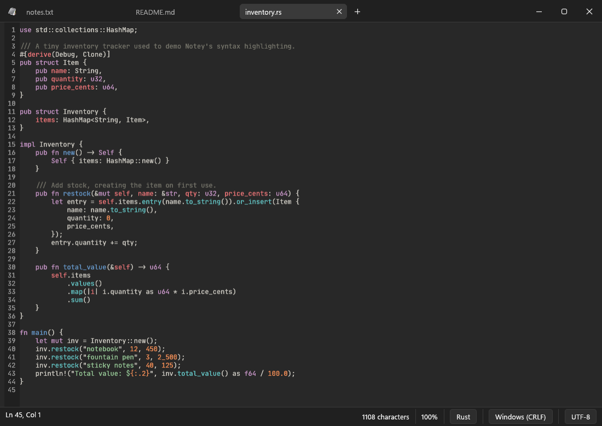

# Notey

A native Rust notepad for Windows with dark mode, tabs, and spellcheck.
Built with [egui/eframe](https://github.com/emilk/egui) and
[spellbook](https://github.com/helix-editor/spellbook) (Hunspell-compatible).



The UI is styled after Fluent / WinUI (Windows 11 Notepad): a frameless
window with a custom title bar containing the tab strip and caption
buttons, Fluent dark and light palettes (`src/theme.rs`), Segoe UI
Variable, rounded menus and dialogs, and an accent-colored selection.
Window dragging, double-click maximize, and edge resizing are all
implemented on top of the frameless window.

By default there is no menu bar — the File/Edit/View/Help menus open from
the Notey icon in the top-left of the title bar. Turn on "Always show menu
bar" in Edit > Preferences (Ctrl+,) to get the classic menu row back.

## Run

```
cargo run --release
```

or launch `target\release\notey.exe` directly. You can pass file paths as
arguments (`notey.exe notes.txt`) or drag files onto the window.

Opening a file while Notey is already running adds it as a tab in the
existing window (single-instance forwarding over a named pipe). Pass
`--new-window` to force a separate window instead.

Closing the main window never loses work: open tabs — including unsaved
text — are stored in a session (`%APPDATA%\Notey\data\session.json`, also
snapshotted every ~30 s for crash safety) and restored the next time Notey
starts. Closing an individual tab still prompts to save. Secondary
`--new-window` windows have no session, so they prompt on close instead.

## Features

- **Dark mode** by default (toggle in View menu; remembered between runs)
- **Tabs** — Ctrl+N new tab, Ctrl+W close, Ctrl+Tab / Ctrl+Shift+Tab to switch,
  middle-click a tab to close it, unsaved-changes prompt on close
- **Spellchecker** (plugin) — red underline on misspelled words; right-click
  a word for suggestions or "Add to dictionary"; dictionaries come from
  Language plugins
- **Syntax highlighting** (plugins) — one File Type plugin per language (45
  available), auto-detected by file extension with a filterable language
  picker in the status bar and a dedicated Language menu for untitled files
- **Themes** — built-in Notey Dark and Light themes plus imported VS Code
  color-theme JSON/JSONC and TextMate `.tmTheme` files; workbench colors apply
  across the full Notey interface and `tokenColors` drive syntax highlighting.
  Notey can also import a copied `vscodethemes.com` URL by downloading and
  extracting the complete theme from its Visual Studio Marketplace extension;
  downloaded packages and all their theme variants remain available under
  View > Theme > Installed Themes
- File: New Tab / New Window / Open / Save / Save As / Print / Exit
- Edit: Undo, Redo, Cut, Copy, Paste, Delete, Find, Find Next (F3),
  Find Previous (Shift+F3), Replace, Go To line (Ctrl+G), Select All,
  Time/Date (F5), Preferences (Ctrl+,)
- **Search**: regex find/replace via fancy-regex (lookaround +
  backreferences, `$1` capture expansion in Replace), Mark All match
  highlighting (preview editor), and **Find in Files** (Ctrl+Shift+F) —
  background directory grep respecting .gitignore, with a results panel
  and click-to-open at the matching line
- **Preferences** (Edit > Preferences): font picker (all installed system
  fonts, with filter), font size, line height, line numbers, word wrap,
  font ligatures on/off — all persisted between runs
- View: Zoom (Ctrl+Plus / Ctrl+Minus / Ctrl+0), status bar toggle,
  spellcheck toggle, theme selection, local theme import, and
  `vscodethemes.com` URL import
- Status bar: line/column, character count, zoom, and **clickable** line
  endings (CRLF / LF) and encoding (UTF-8, UTF-8 BOM, UTF-16 LE/BE, ANSI)
  selectors for the current file
- Encoding and line endings are detected on open and preserved on save
- **File watching**: open files are polled for on-disk changes — a prompt
  offers Reload / Keep when another program modified the file (deletions
  are flagged in the status bar)
- **Recent Files** submenu in the File menu (last 10, persisted)
- **Autosave** (Preferences): periodically saves modified file-backed tabs

## Editor

Notey's default editor is its own virtualized widget (`src/editor.rs`),
which replaced egui's TextEdit in 0.4.0; Preferences > Editor >
"Virtualized editor" switches back to the classic one. It lays out only the
visible lines, so large files stay responsive, and it owns its
cursor/selection/undo model (the foundation for multi-cursor, folding, and
markers on the Notepad++ roadmap). For syntax highlighting, parse states are
cached per line so only visible lines are ever parsed. It also supports word wrap
(per-line wrap-row cache with placeholder invalidation), **multi-cursor
editing** (Ctrl+Click
to add cursors, Alt+drag for column/box selection, Escape to collapse; all
cursors type/delete/paste simultaneously as one undo step), spellcheck with
right-click suggestions, visual-row cursor navigation, undo integration for
find/replace and plugin edits, and basic IME (caret-anchored candidate
window, committed text insertion — no inline composition preview yet;
the classic editor has it). Core logic is unit-tested (`cargo test`).

## Plugins

Notey keeps its core minimal; everything else is a plugin, managed from
**Plugins > Manage Plugins** in three tabs:

- **Features** — Spellcheck, Markdown Tools (Ctrl+B/I/E/K formatting, list
  continuation, rendered and side-by-side preview), Word Count, Autocorrect,
  and Export & Print (HTML export, formatted printing via your browser).
- **Languages** — one spellcheck dictionary each (16 available: English
  variants, Spanish, French, German, Italian, Portuguese, Dutch, Polish,
  Swedish, Danish, Russian, Ukrainian). A word is accepted if any enabled
  language knows it; "Add to dictionary" words are saved permanently.
- **File Types** — syntax highlighting, one plugin per file type (45
  available). Open a file Notey doesn't recognize and the status bar offers
  the matching plugin.

Official plugins download from this repo's [`plugins/`](plugins/) folder
and are checksum-verified before install. The installer includes a default
set (Spellcheck, English (US), Markdown Tools, Word Count, and common file
types), so everything works offline out of the box.

You can also write your own Rhai scripts in `%APPDATA%\Notey\scripts`;
they appear in the Plugins menu (Plugins > Reload Scripts picks up
changes). See [docs/plugin-api.md](docs/plugin-api.md). Scripts can't
touch files or the network unless they declare a permission, and a
failing script can never corrupt the buffer: scripts edit a snapshot that
is only applied when they finish.

## Installer

`installer/notey.iss` is an Inno Setup script. Build it with:

```
ISCC.exe installer\notey.iss
```

which produces `installer_out\NoteySetup.exe`. The installer is per-user (no
admin rights needed) and:

- installs to `%LOCALAPPDATA%\Programs\Notey` with a Start menu entry and
  uninstaller
- registers Notey in the **Open with** menu for common text extensions
  (.txt, .log, .md, .json, .xml, .csv, .yaml, .toml, .ini, …)
- optionally adds "Open with Notey" (tab in the existing window) and
  "Open in new Notey window" right-click entries for all files
  (shown under "Show more options" on Windows 11)
- optional desktop shortcut (unchecked by default)

Rebuild the app first (`cargo build --release`) so the installer picks up the
latest exe.

## Notes

- Print works on saved files: it hands the file to the default `.txt` print
  handler via the shell Print verb.
- The spellchecker skips words with digits, URLs/emails (heuristic), and is
  automatically disabled for files larger than 512 KB.

## Download

Grab `NoteySetup.exe` from the
[latest release](https://github.com/deepfold9118/notey/releases/latest).
The installer is per-user and needs no administrator rights. See
[CHANGELOG.md](CHANGELOG.md) for what changed in each version.

## License

Notey is licensed under the [Apache License, Version 2.0](LICENSE).

Official plugins under [`plugins/`](plugins/) keep their upstream licenses,
which ship inside each plugin: spellcheck dictionaries come from the
[LibreOffice dictionaries](https://github.com/LibreOffice/dictionaries)
project, and file type grammars from
[Sublime Text's Packages](https://github.com/sublimehq/Packages) with
[bat](https://github.com/sharkdp/bat)'s syntect compatibility patches.
